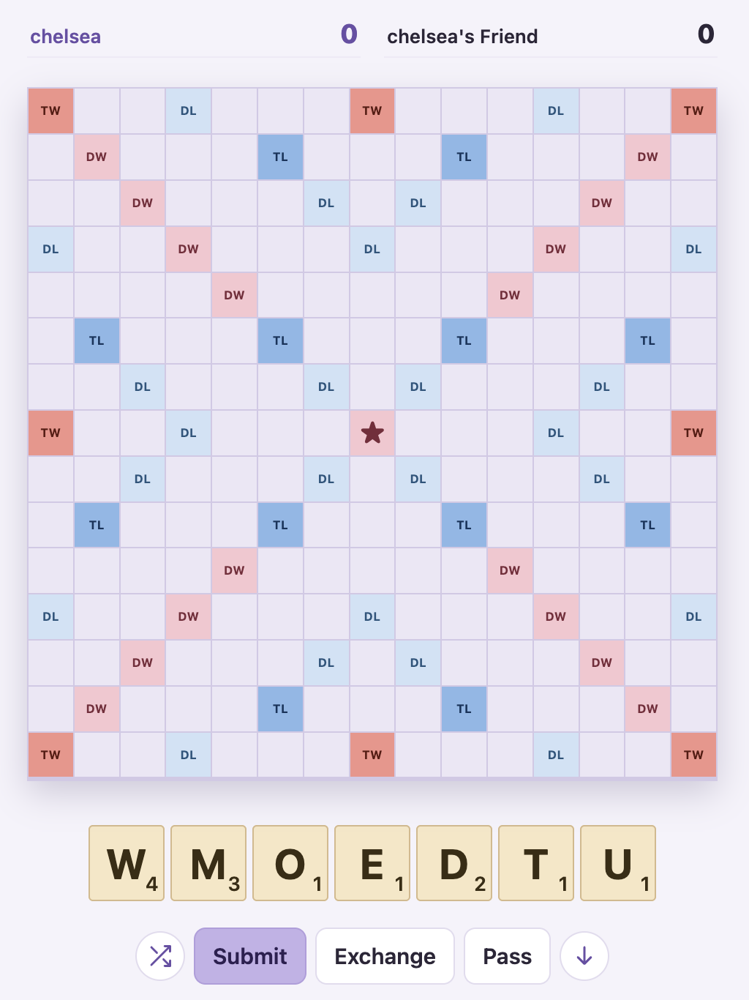

# Scrabble at Home

A small self-hosted Scrabble site for 2–4 players. Python 3 + Flask, plain HTML/JS/CSS.



## Run it

```bash
pip3 install -r requirements.txt
python3 app.py                       # shared password is "default"
python3 app.py --password hunter2 --port 8000
```

The server prints a local URL and a LAN URL (e.g. `http://192.168.1.20:8000`).
Anyone on your network can open the LAN URL. For family outside your home,
forward the port on your router to this computer and share your public IP.

Everyone logs in with **the shared password** plus **any name they like**. That
name is their identity: logging in with the same name on another device picks
the same seat back up.

## Dictionary

Words are checked against **TWL06** (178,691 words), bundled as `twl06.zip` and loaded at
startup. TWL06 is the 2006 North American tournament list, so a few newer words such as
OK, EW and ZE are not included.

## Data

Games live in memory only. Restarting the server ends all games and logs everyone out.
Edits to templates, CSS and JS show up on a page refresh without a restart; changes to the
Python code need one.

## Tests

```bash
python3 -m unittest discover -s tests -v
```

`tests/test_scoring.py` covers premium squares, multi-word plays, hooks, blanks and bingos,
with each expected score worked out in the comments. `tests/test_game.py` covers the
waiting room, exchanges, the end of the game and the live preview endpoint.
